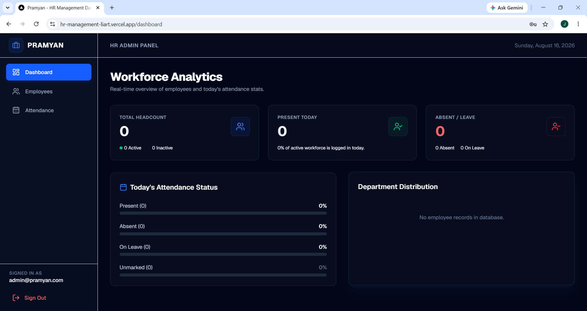
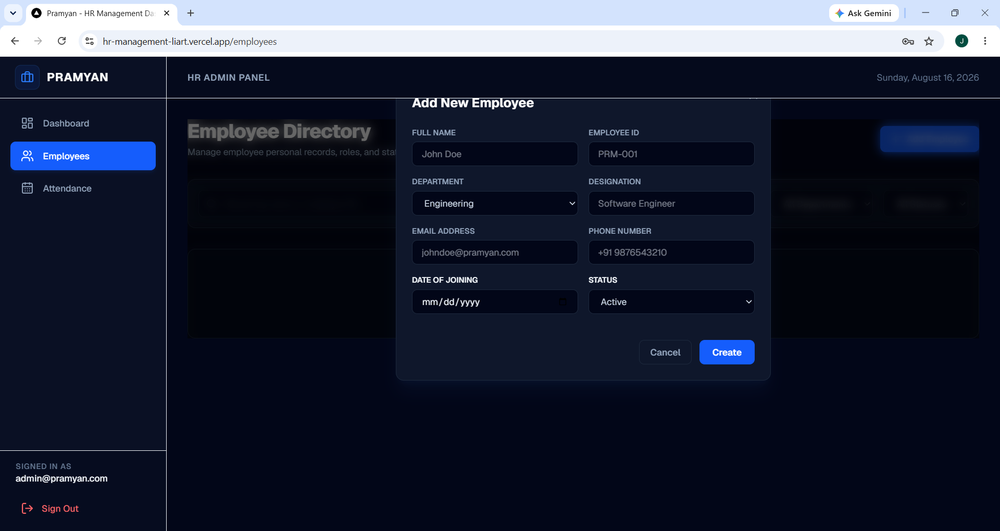
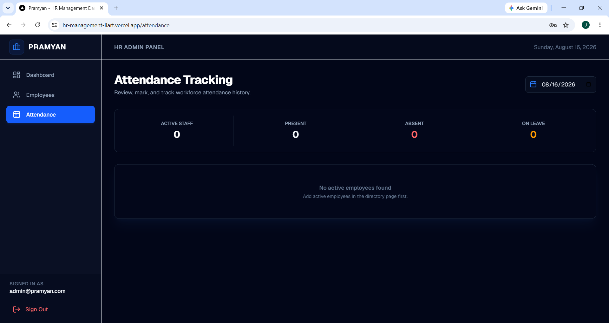
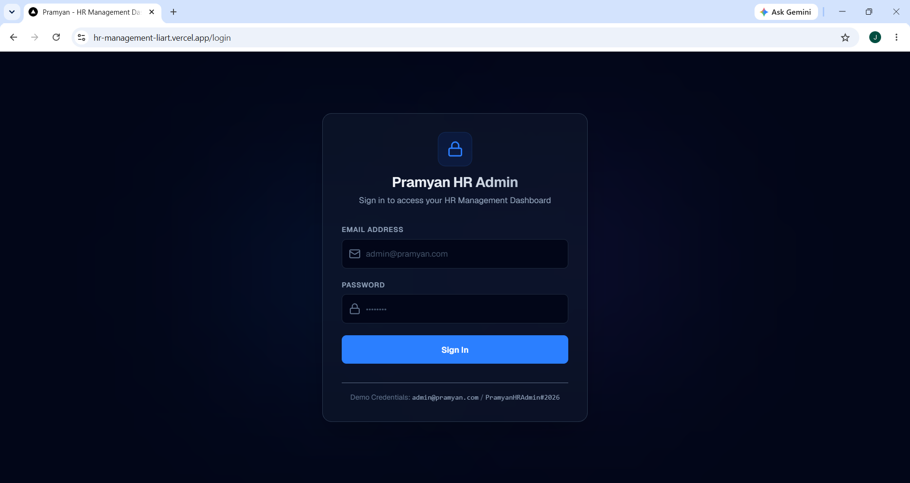

# Pramyan HR Management Dashboard

A simplified full-stack **HR Management Dashboard** designed and built as a take-home technical hiring assignment for the Full Stack Developer Intern position at Pramyan. 

This repository implements token-based authentication (JWT), complete Employee CRUD operations, daily attendance tracking logs, and a workforce analytics dashboard.

---

## 🛠️ Tech Stack Used

- **Frontend**: Next.js (App Router, React 19), Tailwind CSS, Lucide React (Icons).
- **Backend**: Node.js, Express.js (ES Modules), JSON Web Tokens (JWT) for sessions.
- **Database**: MongoDB (Mongoose ODM).

---

## 📸 Screenshots

Here are some previews of the dashboard in action. You can capture screenshots of your running app and place them in a `/screenshots` folder to display them here!

| **Dashboard Analytics Overview** | **Employee Directory & CRUD** |
| :---: | :---: |
|  |  |

| **Attendance Sheets Log** | **Responsive Navigation & Profile** |
| :---: | :---: |
|  |  |

---

## 🏗️ Architecture Design

We implement a decoupled client-server architecture to ensure high code quality, security, and separation of concerns:

```
HRManagement/
├── backend/            # Express.js REST API
│   ├── config/         # MongoDB and Seeding configs
│   ├── controllers/    # API logical controllers
│   ├── middleware/     # JWT Authorization checks
│   ├── models/         # Mongoose Schemas (User, Employee, Attendance)
│   ├── routes/         # Express Router paths
│   └── server.js       # App entry point
└── frontend/           # Next.js Client
    ├── src/
    │   ├── app/        # App Router Pages (Login, Dashboard, CRUD, Attendance)
    │   ├── components/ # Reusable UI Components (Sidebar)
    │   └── context/    # Global Authentication & Session Context
```

---

## 🚀 Setup & Execution Instructions

Follow these steps to run both the backend server and frontend client locally.

### Prerequisites
- Make sure [Node.js](https://nodejs.org/) (v18+) is installed.
- Ensure [MongoDB](https://www.mongodb.com/try/download/community) is running locally or prepare a MongoDB Atlas connection URI.

---

### Step 1: Backend Setup

1. Open your terminal inside the `/backend` folder:
   ```bash
   cd backend
   ```

2. Create/edit the `.env` file in the `backend` folder:
   ```env
   PORT=5000
   MONGODB_URI=mongodb://localhost:27017/hr_management
   JWT_SECRET=supersecretjwtkeyforhrmanagement123
   NODE_ENV=development
   ```
   > ⚠️ **Note**: If using MongoDB Atlas, replace `MONGODB_URI` with your connection string.

3. Install backend dependencies:
   ```bash
   npm install
   ```

4. **Seed the database** to generate the default admin user:
   ```bash
   node config/seed.js
   ```
   *Expected output: `Default admin seeded successfully! (admin@pramyan.com / admin123)`*

5. Run the backend API server:
   ```bash
   npm run dev
   ```
   *The backend will boot up at `http://localhost:5000`*

---

### Step 2: Frontend Setup

1. Open a new terminal inside the `/frontend` folder:
   ```bash
   cd frontend
   ```

2. Verify or create a `.env.local` file inside the `frontend` folder:
   ```env
   NEXT_PUBLIC_API_URL=http://localhost:5000/api
   ```

3. Install frontend dependencies:
   ```bash
   npm install
   ```

4. Launch the Next.js development server:
   ```bash
   npm run dev
   ```
   *The frontend dashboard will boot up at `http://localhost:3000`*

---

## 🔑 Login Credentials

Log in using the pre-seeded admin credentials:
- **Email**: `admin@pramyan.com`
- **Password**: `PramyanHRAdmin#2026`

---

## 🔌 API Endpoints Summary

### Authentication
- `POST /api/auth/login` - Authenticate admin credentials and retrieve JWT.
- `GET /api/auth/me` - Validate session token (private).

### Employee Management
- `GET /api/employees` - Retrieve employees (supports search & filters) (private).
- `GET /api/employees/:id` - Fetch details for a specific employee (private).
- `POST /api/employees` - Create a new employee document (private).
- `PUT /api/employees/:id` - Update employee details (private).
- `DELETE /api/employees/:id` - Delete an employee record (private).

### Attendance Tracking
- `POST /api/attendance` - Record/update employee attendance for a given date (private).
- `GET /api/attendance/date` - Get all attendance records for a target date (private).
- `GET /api/attendance/employee/:id` - Get attendance history logs for a single employee (private).

### Analytics Dashboard
- `GET /api/dashboard/stats` - Fetch total headcount, active status split, today's attendance stats, and department headcount aggregates (private).

---

## 📌 Assumptions & Design Choices

Following the guidelines in the assignment:
1. **Admin Credentials**: We assume a single pre-seeded administrator is sufficient for evaluating HR Admin capabilities. This user (`admin@pramyan.com`) is populated into MongoDB cloud collections during initial setup via a seeder script.
2. **Decoupled API Server**: Since the hiring team utilizes a separate Node/Express backend and Next.js frontend day-to-day, we opted to build these layers as decoupled services communicating over HTTP/CORS instead of combining them into Next.js serverless handlers.
3. **Daily Attendance Lock**: We assume that an employee can only have one attendance log per date. We enforced this at the database layer with a compound unique index on `{ employee, date }` in the Attendance Schema.

